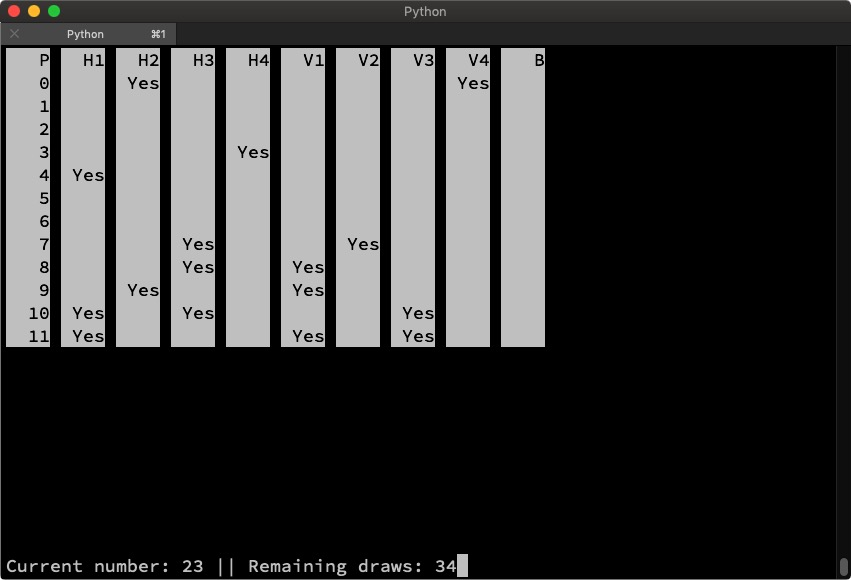

# Bingo

Utility scripts for running and hosting a game of _Bingo_.



# Dependency

```drawer.py``` depends on curseXcel by @coffeeandscripts, 
which itself depends on the standard ```curses``` module.

Install it using ```pip3 install curseXcel```

# Usage

## generate.py

This script is used to generate the sheets with 16 numbers each for the players.
On execution, it asks you how many sheets you need and outputs them to ```cards.json```.

## cards2html.py

Takes the contents of ```cards.json``` and outputs a nicely formatted ```cards.html``` file that can be used to print the sheets on paper.

## drawer.py

This script draws the numbers 1-99 in random order.
It also shows you information about the cards in ```cards.json``` in a table.

## cards2printer.py

Same as cards2html.py, but prints them to a thermal printer using [python-escpos](https://github.com/python-escpos/python-escpos)

